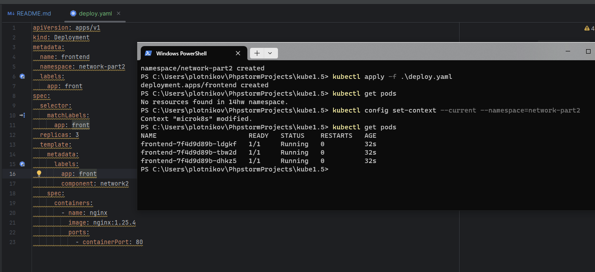
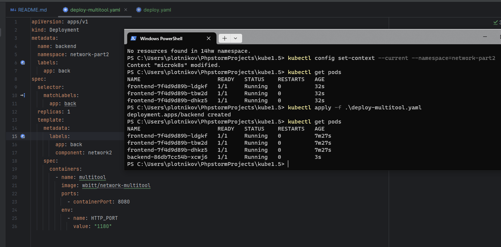
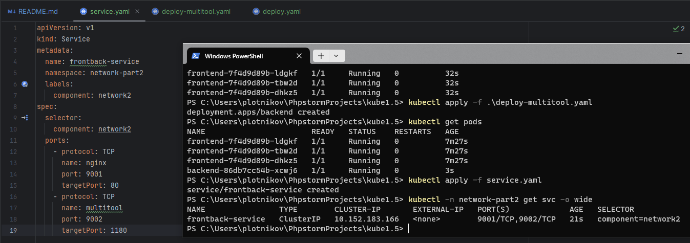
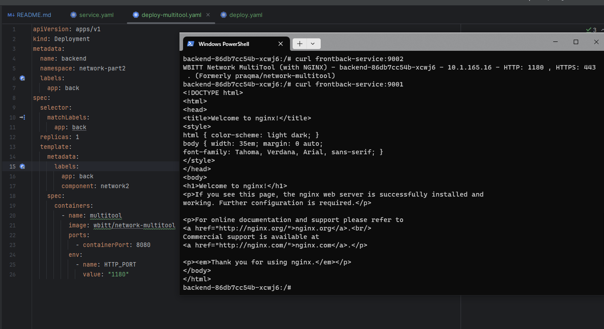
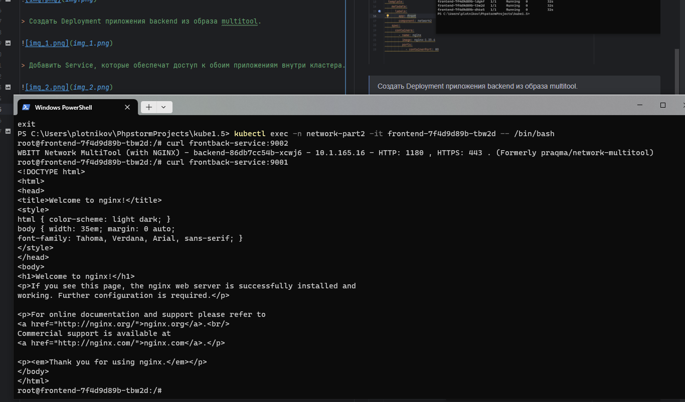
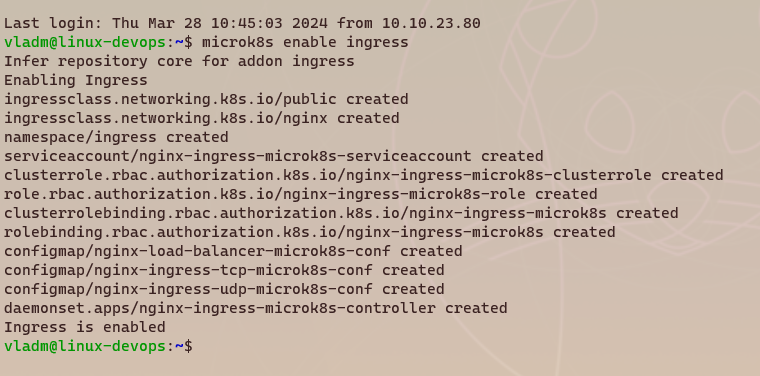
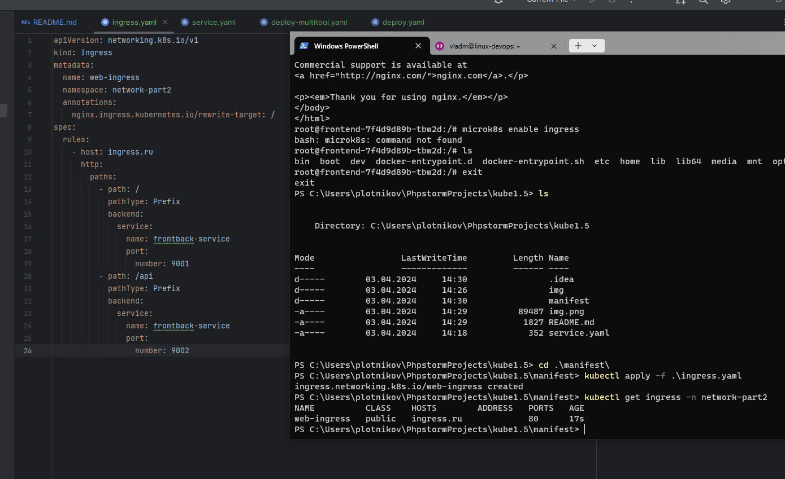
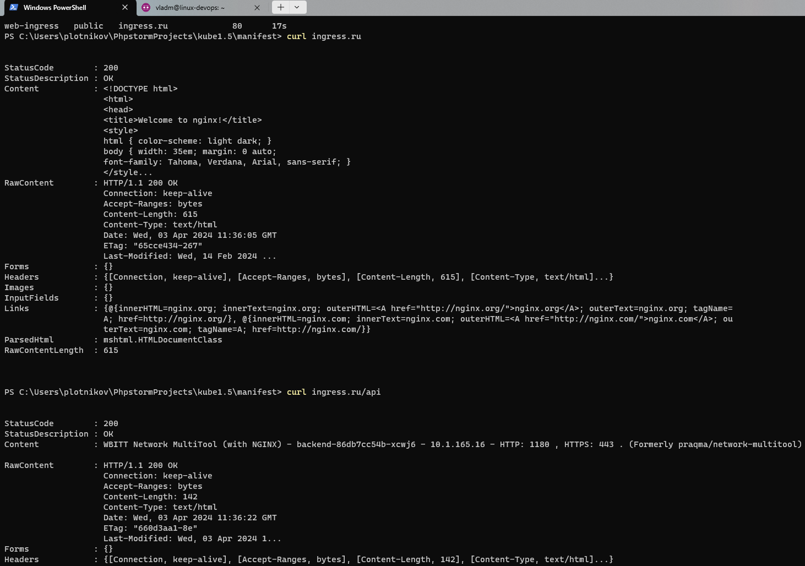

# Домашнее задание к занятию «Сетевое взаимодействие в K8S. Часть 2»
### Задание 1. Создать Deployment приложений backend и frontend
> Создать Deployment приложения frontend из образа nginx с количеством реплик 3 шт.

> Создать Deployment приложения backend из образа multitool.

> Добавить Service, которые обеспечат доступ к обоим приложениям внутри кластера.

> Продемонстрировать, что приложения видят друг друга с помощью Service.

> Предоставить манифесты Deployment и Service в решении, а также скриншоты или вывод команды п.4.

[Манифесты тут](./manifest)

---
### Задание 2. Создать Ingress и обеспечить доступ к приложениям снаружи кластера

> Включить Ingress-controller в MicroK8S.

> Создать Ingress, обеспечивающий доступ снаружи по IP-адресу кластера MicroK8S так, чтобы при запросе только по адресу открывался frontend а при добавлении /api - backend.
 

 
> Продемонстрировать доступ с помощью браузера или curl с локального компьютера.
 

 
> Предоставить манифесты и скриншоты или вывод команды п.2.

Скриншоты предоставлен, [вот тут манифест](./manifest/ingress.yaml)